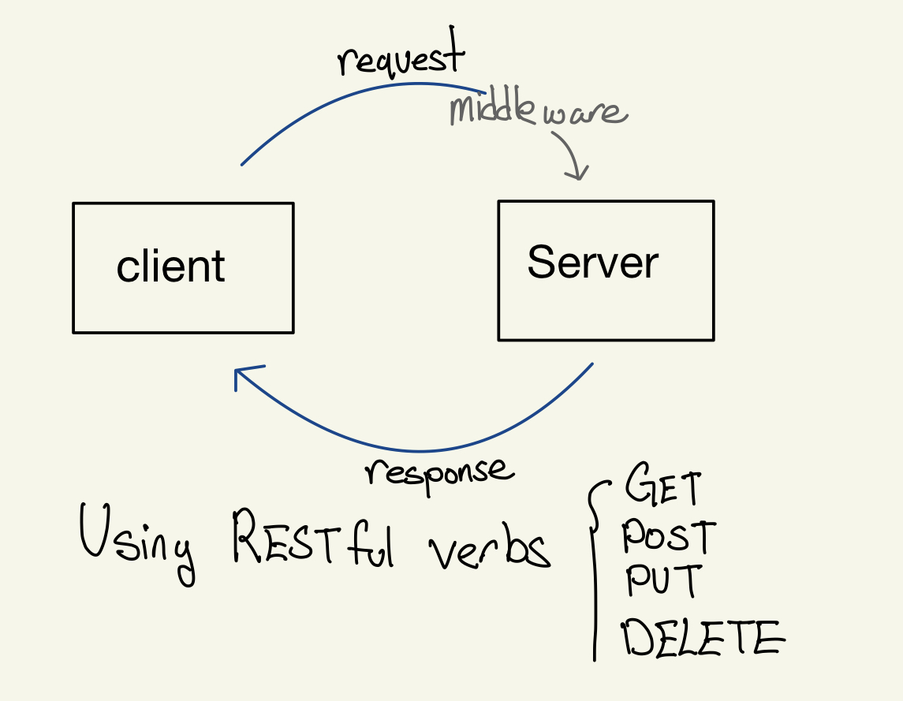

# LAB - Basic Express Server

### Author: Ellis Yoo

### Links and Resources

- [ci/cd](https://github.com/yjyoo773/basic-express-server/actions)
- [back-end server url](https://ellis-basic-express-server.herokuapp.com/)

### Setup
#### How to initialize/run your application (where applicable)
- Dependencies
  - dotenv
  - express
  - jest
  - supertest
- Application is initialized by `npm start`

#### Tests

- How do you run tests?   
  By running `npm test` on the terminal, application will run 6 tests total.   
- Any tests of note?  
  The tests are based on checking if that status of the route is correct accordingly or if the response gives the correct data type. As for the test of checking status 500
  if no name is in the query string, I have set it up on both `server.test.js` and `validator.test.js` as I was unsure on where to place it. 
- Describe any tests that you did not complete, skipped, etc
  The `logger.test.js` was used from the provided demo code. 
  
#### UML / Application Wiring Diagram

